# Rapid Responde Team rostering { #epr-rrt-design }

## Introduction

The DHIS2 Rapid Response Team (RRT) Roster is an adaptable and flexible digitized workforce system that helps manage public health RRTs during routine (non-emergencies) and emergencies. Built on the DHIS2 platform that is used in over 40 countries for health surveillance, the RRT Roster aims to accelerate the identification and deployment of appropriate RRT members during public health emergencies. It is the first module of its kind to integrate responder data with the DHIS2 surveillance systems.

Developed in collaboration with the US CDC’s Emergency Response Capacity Team (ERCT), the RRT Roster module uses DHIS2’s advanced data and analytics tools to streamline RRT workforce management. The DHIS2 system guides users through the RRT workforce cycle, from finding and selecting staff to notifying, and deploying them for an emergency. This makes it faster and more efficient to mobilize skilled teams as well as support with workforce forecasting and deployment analysis.

The system follows a customizable six-step process: registration, vetting, responder selection, readiness tracking, deployment notifications, and post-deployment evaluation ensuring a systematic approach to managing emergency RRT responders. Data management capabilities such as ease of data entry, deployer selection, data validation, data shareability and analysis are also incorporated into the process. Other key features include automated notifications and customizable visual dashboards, along with reporting tools that help managers and leadership make better decisions during an emergency.

This system design document offers a comprehensive overview of the ERR configuration within DHIS2, including detailed descriptions of the Tracker and dashboard functionalities, data management strategies, and implementation considerations. This document also does not consider the resources and infrastructure needed to implement such a system, such as servers, power, internet connections, backups, training and user support, which can be found in the . The tracker was designed based on CDC RRT Roster and Management Guidelines.

Reference metadata for this toolkit is available at [dhis2.org/metadata-downloads.](https://dhis2.org/metadata-downloads/)

### Acknowledgements

The Rapid Response Team Rostering Tool was developed in partnership with US CDC’s Emergency Response Capacity Team and HISP Uganda, with funding support through a cooperative agreement between HISP Centre and US CDC. We would like to extend our gratitude to the Ministries of Health in Uganda, DRC and Sierra Leone, CDC staff and the community who contributed their inputs, field experiences and expertise to the development of the tool.

## System design overview

### Use case

Rapid Response Teams (RRTs) are multidisciplinary teams that are trained and equipped to rapidly respond to public health emergencies.

A roster is a searchable system that stores and manages up-to-date information about Rapid Response Team (RRT) responders and members. It functions as a registry of specialists, tracking essential data such as skills, location, availability, and readiness requirements. This system allows for quick identification of staff with the necessary skills for deployment in public health emergencies. A roster may also be referred to as a personnel management or workforce system, designed to support efficient emergency response operations.

A well-maintained roster is crucial for efficient emergency preparedness and response. It ensures that health authorities can quickly mobilize qualified staff by having a comprehensive view of each RRT member's skills, training, and readiness status. Key benefits of having a roster include:

- Rapid identification of RRT members with the necessary skills and characteristics to meet the needs of an emergency response
- Efficient mobilization of surge staff with up-to-date contact information, ensuring immediate response
- Monitoring and optimizing the composition of the roster to ensure preparedness
- Tracking readiness requirements such as completed trainings and certifications, ensuring staff are prepared for deployment

The RRT roster system supports the entire staffing and deployment process, from identifying and selecting candidates to tracking their readiness and managing their post-deployment evaluations. The system operates through a six-step workflow: RRT staffing recruitment and registration, vetting of candidates, selection of candidates, deployment readiness, deployment notification through pushed- and automated communications, and post-deployment evaluation including in-depth analysis dashboards and reporting.

This system is not only valuable during emergencies but also plays an essential role in preparedness during non-emergency periods. In preparedness mode, it allows users to monitor staff skills, track training completion, assess surge capacity readiness, and verify staff participation in previous responses. In response mode, the system facilitates the rapid selection and deployment of responders, monitors the availability of surge capacity, and checks the status of ongoing deployments.

By integrating robust data management, real-time communication, and in-depth workforce analysis, a roster maximizes both response efficiency and effectiveness, ensuring a well-prepared and capable public health emergency response team.

### Intended users

When integrated into a national DHIS2 system, the DHIS2 Rapid Response Team (RRT) Roster can be effectively utilized at any level – national, subnational or district – during both routine (non-emergency) and emergency response phases. Key functions including roster management, candidate selection and workforce recruitment and verification can be adapted based on the size of the roster and needs of the response.

#### National and Subnational RRT Manager or RRT Roster Manager

At the national or subnational level, RRT Managers or RRT Roster Managers are responsible for ensuring the RRT Roster is effectively established and maintained during non-emergency periods and utilized during emergency periods. An RRT Manager or RRT Roster Manager may utilize the system during the non-emergency phase to:

- recruit potential responders
- identify, verify, and accept candidates for current and future roles
- monitor skills and experience of rostered staff for timeliness and accuracy
- track completed and needed trainings
- communicate with rostered staff about readiness.

The suite of management tools provides valuable non-emergency insights such as submission metrics, application data, and automatic staff selection notifications. Furthermore, managers can generate reports on responder demographics, workforce skills capabilities, availability forecasting, and training and readiness requirement completion.

During an emergency or outbreak, RRT Managers or RRT Roster Managers can use the verification, search, and notification features to identify and select responders based on technical skills, language proficiency, availability, and location. Managers may also utilize the system to customize dashboards for management support and showcase surge capacity, deployments, and other critical response metrics for a variety of audiences including EOC staff and leadership.

#### District Level Workforce Managers

District Workforce Managers support their district’s roster during the non-emergency and emergency phases. Workforce Managers may use the system to select staff, ensure roster information is accurate and up to date, and ensure their district has sufficient personnel with specialized skills to support core RRT functions and surge capacity. During emergencies, District Managers may be responsible for deploying staff into the field, ensuring effective response at the local level.

#### Potential RRT Responders

Potential RRT Responders are staff who are applying to serve as part of a RRT roster. Potential responder candidates are dependent on country requirements but can include active full-time technical and operational staff, active part-time technical and operational staff, retired public health workers, Fellows, students, and non-technical surge support volunteers. Staff interested in joining the roster will use the system to complete the RRT Roster application. Application data will be dependent on the requirements of the country but may include demographics, education, technical and language skills, relevant trainings, and availability.

#### Selected RRT Responders

Once approved and selected, RRT Responders may use the system to update their personal information, such as demographics, education, and skills. Responders may also use the system to update training completions as well as readiness requirements including passports, medical clearances, and safety trainings. During an emergency, responders may receive notifications about potential deployments, and upon return from the field, may be asked to upload important documents such as handover notes and evaluation forms.

#### Supervisors and Managers

A requirement for RRT Responder acceptance, may include supervisory approval from the responder’s home program. Program supervisors and managers will use the system to review and approve staff to be considered to join the roster.

#### Emergency Coordination Unit (ECU) and Emergency Operations Center (EOC) Staff

Responsible ECU and EOC staff at national or sub-national levels can use the system’s dashboard feature to assess surge capacity readiness during the watch or non-emergency phase and monitor availability and workforce allocation during a response. Customizable dashboards that are completed by the RRT Manager or RRT Roster Manager may provide ECU and EOC staff a visual overview of the roster’s size, skill availability and need, and potential surge staff, enabling the PHEOC or ECU staff to make informed planning, operational and logistics decisions prior to and in real-time during an emergency.

#### Leadership

Leadership, including Ministry of Health and National Public Health Institute (NPHI) officials, can utilize the system’s dashboard and analytical tools to gain insights into workforce management. Customizable dashboards, created by RRT Managers or RRT Roster Managers, offer detailed visual reports on deployed and available personnel. Leadership can access this information to provide a comprehensive view of imminent, ongoing, and completed deployments, enabling informed decisions about critical human resource allocation and geographic positioning in the field.

The dashboard also offers key metrics, such as total person-days, roles filled and required, and average deployment length, helping leaders assess the effectiveness of RRT rostering. By tracking RRT roster non-emergency and emergency data, leadership can better understand the system’s impact on response efforts and the overall effectiveness of RRT programs during public health emergencies.

## Tracker

The rostering tool was designed to support the following functionalities. DHIS2 software features are configured and used to meet these needs. Additional functionalities may also be integrated into the roster through local adaptation, extension and customization.

### Tracker program structure

The tracker program structure is as follows:

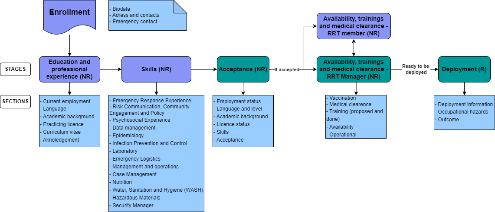

The stages and flow of information is meant to represent a generic flow of information and accesses based on different roles, proper of a rostering including several elements:

- Information flow:
  - Admission process:
    - Submission of a candidature: Enrollment, Education and professional experience and skills
    - Vetting: Verification and acceptance
  - Maintenance: Candidate deployment availability, completion of required trainings, and medical clearance
  - Deployment: Deployment
- Accesses based on roles (refer to the above image for the colours):
  - Potential and selected RRT members / responders: purple 
    - Enrollment - Potential RRT members
    - Education and professional experience - Potential RRT members
    - Skills - Potential RRT members
    - Deployement availability, trainings and medical clearance - Selected RRT members
    - Post-Deployement - RRT Responders
  - RRT Manager(s): green
    - Acceptance
    - Deployment availability, trainings and medical clearance - Selected RRT members
    - Deployment
    - Post-Deployment

| Stage                                                       | Description                                                                                                                                                                                                                                                                                                         |
|-------------------------------------------------------------|---------------------------------------------------------------------------------------------------------------------------------------------------------------------------------------------------------------------------------------------------------------------------------------------------------------------|
| Enrollment                                                  |The enrolment stage collects the basic biodata of the person, address and contacts and emergency contact.  The Tracked Entity Type for the Rapid Response Team program is ‘Person’.  TThe enrolment date is referred as the registration date in the RRT tracker program  **The stage is non-repeatable**               |
| Education and professional experience                       | Collects information on current employment, language and their proficiency, academic background details, practising licence with the possibility of annexing the Curriculum Vitae.  **The stage is non-repeatable**                                                                                                            |
| Skills                                                      | Collects information on skills and their perceived technical level acquired by the responder through their career.  **The stage is non-repeatable**                                                                                                                                                                                                            |
| Acceptance                                                  | Report key information collected on the “Educational and professional experience” and “Skills” stage that are used on the vetting process.  The report date refers to the acceptance date  **The stage is non-repeatable**                                                                                                |
| Availability, trainings and medical clearance - RRT member  | The stage is accessible only once the responder has been accepted to the RRT roster and collects information on availability, medical clearance details such as vaccination and physically suitable certificate, completed training and reports the ones requested to be completed by the supervisor.  **The stage is non-repeatable** |
| Availability, trainings and medical clearance - RRT Manager | The stage is accessible only once the responder has been accepted to the RRT roster, reporting key information collected on the “Availability, trainings and medical clearance - RRT member” to determine if the RRT member is suitable and ready for deployment.  **The stage is non-repeatable**                                          |
| Roster deployment                                           | The stage is accessible only once the RRT member has been confirmed to be suitable and ready for deployment and collect information on the deployment details, occupational hazards and outcome. The report date refers to the date in which the deployment has been offered to the RRT member  **The stage is repeatable**         |

### Tracked Entity Type

The DHIS2 Rapid Response Team rostering tracker program allows for the enrollment of a tracked entity type (TET) ‘person’.

### Enrollment

When a person is enrolled in the Rapid Response Team roster program as a Tracked Entity Instance (TEI), Tracked Entity Attributes (TEA) are recorded to form the case profile. Note that several TEAs are shared across DHIS2 Tracker programs; these are configured with a prefix ‘GEN’ (general) to indicate they are shared between tracker programs. Check out the [Common Metadata Library](https://docs.dhis2.org/en/implement/health/dhis2-health-data-toolkit/common-metadata-library/design.html) for more information on shared tracker metadata.

The TEA **System ID** serves as a unique identifier in order to streamline the identification process when the responder or RRT member needs to be searched in the system. The **System ID** value is automatically generated with the pattern “RANDOM(*****)” to serve as an example, please refer to the [DHIS2 User Documentation on configuring system-wide unique identifiers as DHIS2 TEAs](https://docs.dhis2.org/en/use/user-guides/dhis-core-version-238/configuring-the-system/programs.html#create_tracked_entity_attribute) for more details and customizations.

On the address and contacts sections, the TEAs **Contact phone number** and **Email** have been marked as mandatory as this elements can be used on the notification sent to the responders

### Stage 1: Education and professional experience (non-repeatable)

On this stage the responder is requested to introduce information related to their current employment, languages, academic background and practising licence.

In the *Current Employment* section, the information related to the supervisor’s name and contacts can be used for notifications or in case approval of deployment and/or validation of availability.

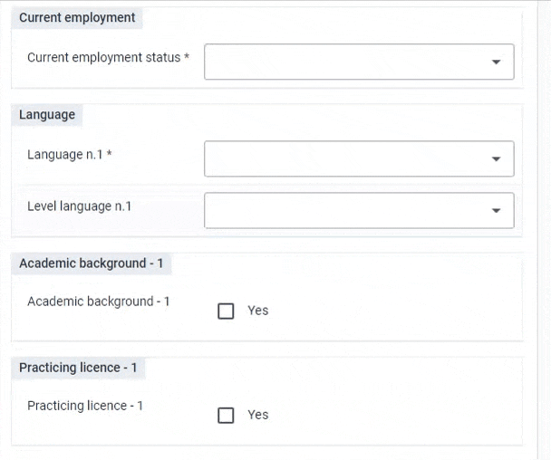

Up to three languages with their corresponding levels can be entered and they are shown/hidden through a series of Program Rules.
Both the numbers of languages and the options of languages and levels need to be adapted to the local implementation as in the toolkit they serve as an example of implementation.

Both **Academic background** and **Practising Licence** are distributed in repeated sections that are shown/hidden if selected

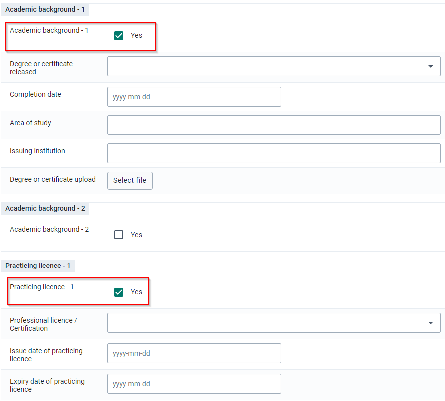

In case it is available, the Curriculum Vitae can be attached and to be able to save and complete the stage, the responder has to acknowledge that the information reported are true to the best of their knowledge.
This last step need to be customised according to the local implementation legislation

[CV and Acknowledgement section](resources/image/RRT_005.png)

### Stage 2: Skills (non-repeatable)

In this stage the responder is requested to introduce information related to their skills divided by groups:

- Emergency Response Experience
- Risk Communication, Community Engagement and Policy
- Psychosocial Experience
- Data Management
- Epidemiology
- Infection Prevention and Control
- Laboratory
- Emergency Logistics
- Management and Operations
- Case Management
- Nutrition
- Water, Sanitation and Hygiene (WASH)
- Hazardous Materials
- Security Manager

### Stage 3: Acceptance (non-repeatable)

In this stage the RRT manager can accept or not the candidate based on the information provided in the stage **Education and Professional experience** and **Skills** and, to enhance the vetting process, these are manipulated and reported here.

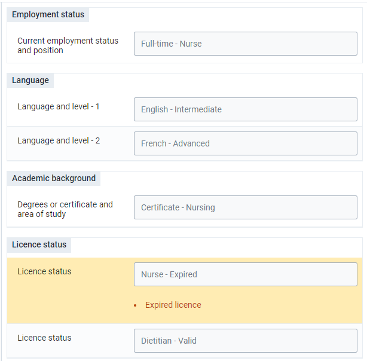

A serie of Program Rules have been created to:

- Combine and report key information as in Employment status, Language, Academic background example and Licence status
- Highlight significant information as the licence expired VS valid according to the **date of expiry** assigned on the Education and professional experience stage

In case the RRT manager will need to consult any attachment that are presents in the **Education and professional experience** stage, can simply open the stage and download them.

Once the RRT manager has revised the necessary information, they can then decide whether the responder can be included or not in the Rapid Response Team and for which role(s) they have been validated for (the list need to be customised prior implementation)

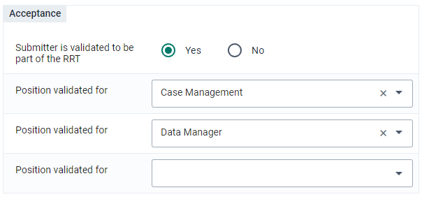

### Stages 4: Availability, trainings and medical clearence (non-repeatable)

The stages **Availability, trainings and medical clearance - RRT member** and **Availability, trainings and medical clearance - RRT manager** are used to track readiness requirements prior the deployment and to confirm or not the readiness of the RRT member and are accessible **only** if the responder has been validated to be part of the RRT.

According to the role assigned to the user, the information reported and available are different:

| Sections                                | RRT member                                          | RRT manager                                                                                 |
|-----------------------------------------|-----------------------------------------------------|---------------------------------------------------------------------------------------------|
| Availability                            | **Report** availability                             | **Consult** availability                                                                    |
| Medical clearance - Vaccination         | **Report** vaccination status                       | **Consult** vaccination status                                                              |
| Medical clearance - Physical evaluation | **Report** physical suitability and any certificate | **Consult** physical suitability                                                            |
| Trainings to be completed               | **Consult** trainings that need to be completed     | **Report** which training should be completed (the list exclude the ones already completed) |
| Trainings completed                     | **Report** the training done                        | **Consult** the training done                                                               |

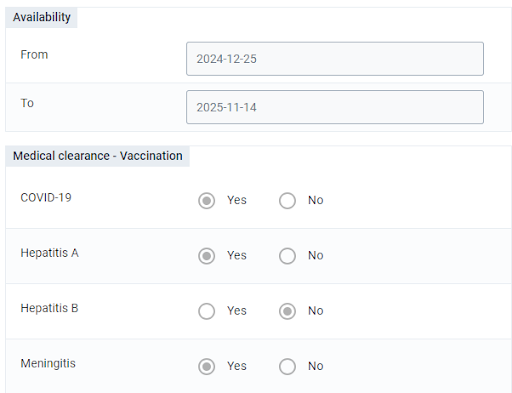

Once all the requirements have been fulfilled, the RRT manager can then select the RRT member suitable for deployment

> **Note:**
> The RRT member can change is suitability for deployment during the time according to the continuous evolving requirements

### Stage 5: Roster deployment (repeatable)

This is the only repeatable stage of the RRT Roster, and each event should correspond to a different deployment. In the case an RRT member has been deployed numerous times during the same public health emergency, we should then have several events corresponding to each of the deployments.

The stage is divided into two main areas:

- Pre-deployment:
  - Deployment information
  - Occupational hazards
- Post deployment:
  - Deployment outcomes
  - Deployment resources

In the **Deployment information** section, the RRT manager will need to report the main details on the emergency operation such as the type of response, place of deployment, type of deployment, position and terms of reference alongside the Team Lead/Supervisor name and contacts.
These information can be used as notification text to inform the RRT member of a possible deployment (see notification section) 

It’s strongly advised to have an Option Set assigned to the Data Element **Name of the emergency operation** for analytics purpose avoiding free text (the option set provide constitute an example)

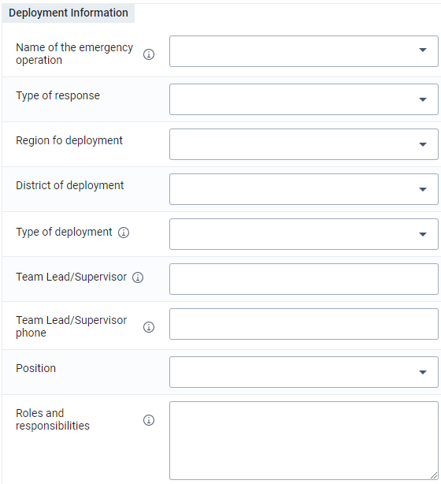

Once the RRT member accepted the proposed deployment and has been deployed, the RRT member and RRT manager can then complete the post-deployment information

### Tracker Data Elements

All data elements configured for the Tracker domain are also included in the Data Element Group ‘RRT’ [VrqFPv5topA]. This serves as a de facto DHIS2 data dictionary for the Rapid Response Team rostering tracker use case. It allows for the data elements to be exported from DHIS2 and used independently of the Tracker program configuration, for example in the case that an implementation redesigns their Tracker from scratch for local workflows.

#### Cloned data elements for multiple option selection

Within all the program stages, there are a number of data elements that are cloned to allow the selection of multiple options for a given concept, sharing the same option set. This design is implemented as follows:

- Cloning of data elements eligible for multi-option choice
- Each cloned data element has its own UID, name and code
- Program Rules:
  - Hide the consequent Data Elements if the previous have not been selected
  - Show error in case the same Option has been selected more than once in the same group of Data Elements

For example, to capture multiple languages, there are a series of data elements that are cloned:

RRT - Language - 1 [jQup5YqFyeP]
RRT - Language - 2 [fHNgUkVmbwZ]
RRT - Language - 3 [xGAMFwiFC7m]

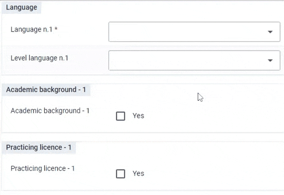

## Dashboard and analytics

Thematic dashboard for monitoring various aspects of the Rapid Response Team rostering toolkit have been developed

### Responder's Overview

This dashboard is meant to provide an example for monitoring different components on the management of a Rapid Response Team roster.

#### Applications overview

Overview of the number of submission, accepted in the RRT and the acceptance rate

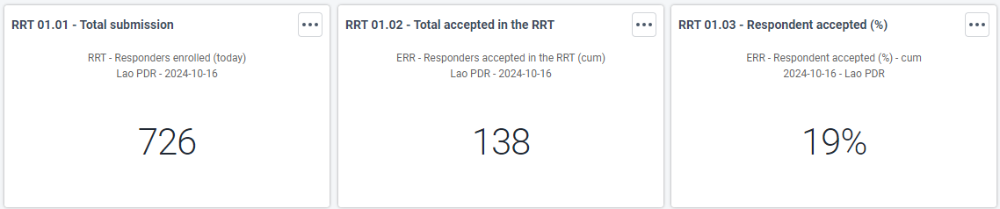

#### RRT members available

RRT members actually available for deployments and their geographic distribution

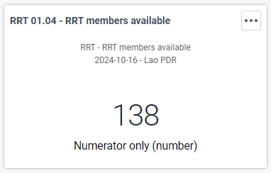

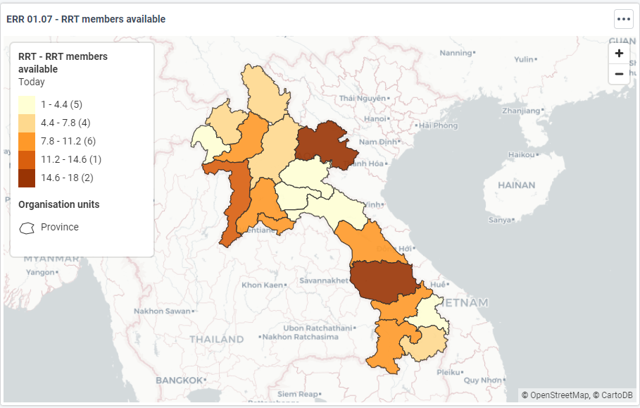

#### RRT members characteristics

Visualisations with the characteristics of RRT members such as the role to which they have been validated, language spoken, working situation, licence status, training and skills.

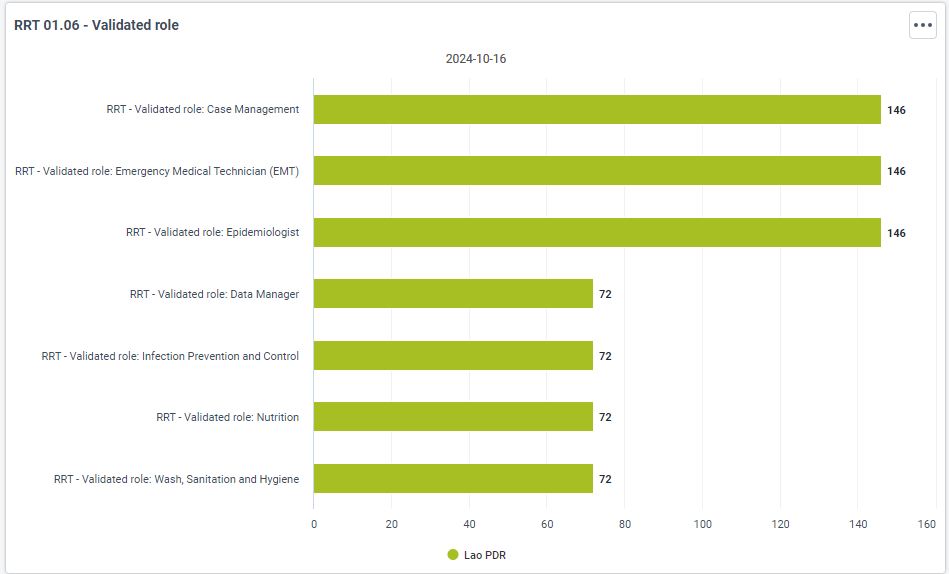

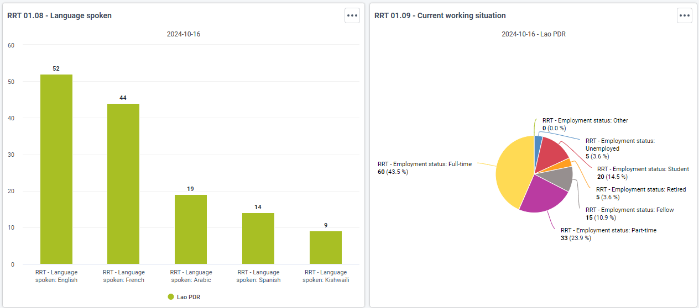

#### RRT member linelist

Deployment RRT Roster Line lists can be customized based on RRT member availability, skills, level of expertise, RRT validated position, languages, and location.  

An example of line list with RRT members and their main/relevant information that can be used for the selection of potential candidates for deployment.

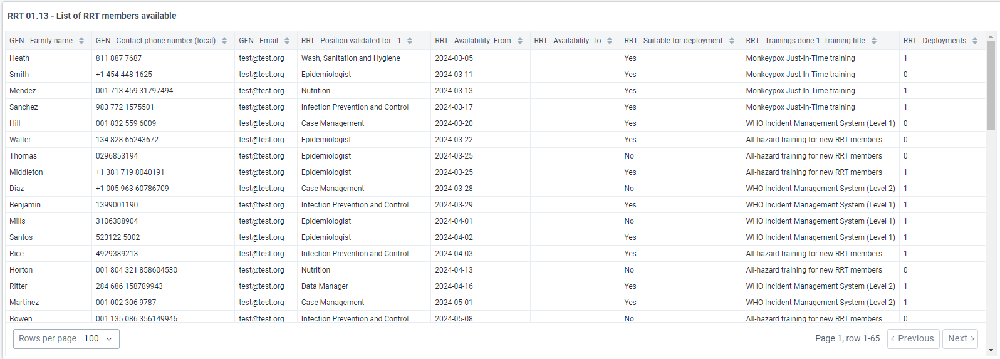

## User group

Three standard group are included in the downloadable .json

| User group         | Metadata          | Data              |
|--------------------|-------------------|-------------------|
| RRT - Admin        | Can edit and view | No access         |
| RRT - Access       | Can view only     | Can view only     |
| RRT - Data Capture | Can view only     | Can edit and view |

In the demo you can find other two groups as an example of access regulation based on the role of the user within the RRT program

| User        | Stage                                                       | Data              | Data              |
|-------------|-------------------------------------------------------------|-------------------|-------------------|
| RRT_member  | Education and professional experience                       | Can edit and view | Can edit and view |
| RRT_member  | Skills                                                      | Can edit and view | Can edit and view |
| RRT_member  | Availability, trainings and medical clearance - RRT member  | Can edit and view | Can edit and view |
| RRT_manager | Education and professional experience                       | Can view only     | Can view only     |
| RRT_manager | Skills                                                      | Can view only     | Can view only     |
| RRT_manager | Acceptance                                                  | Can edit and view | Can edit and view |
| RRT_manager | Availability, trainings and medical clearance - RRT member  | Can view only     | Can view only     |
| RRT_manager | Availability, trainings and medical clearance - RRT manager | Can edit and view | Can edit and view |
| RRT_manager | Roster deployment                                           | Can edit and view | Can edit and view |

The password for both users is the same as the generic demo user: District1#

## Implementation considerations & Local Adaptation

### Notifications

The DHIS2 native **Program notification** functionality can help to streamline and enhance the management of a roster sending automatic notifications to both RRT member and manager.

A series of program notifications have been created in the demo to showcase some of these use cases:

- RRT member is accepted on the roster: a notification is sent to the email of the RRT member to notify that has been accepted to the roster
- Suitable for deployment: a notification is sent to the email of the RRT member to notify that is suitable for deployment
- RRT Required training: a notification is sent to the email of the RRT member to notify that a required training needs to be completed
- Deployment proposal: a notification is sent to the email of the RRT member to notify of a proposed deployment
